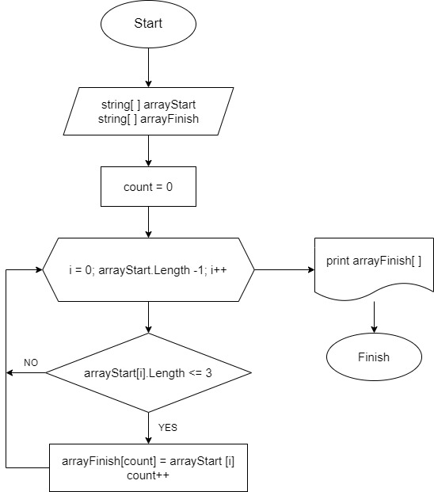

# Final_test_1
## Итоговая контрольная работа по основному блоку
Задача:

1. Создать репозиторий на GitHub
2. Нарисовать блок-схему алгоритма (можно обойтись блок-схемой основной содержательной части, если вы выделяете её в отдельный метод)
3. Снабдить репозиторий оформленным текстовым описанием решения (файл README.md)
4. Написать программу, решающую поставленную задачу
5. Использовать контроль версий в работе над этим небольшим проектом (не должно быть так, что всё залито одним коммитом, как минимум этапы 2, 3, и 4 должны быть расположены в разных коммитах)

Задача: Написать программу, которая из имеющегося массива строк формирует новый массив из строк, длина которых меньше, либо равна 3 символам. Первоначальный массив можно ввести с клавиатуры, либо задать на старте выполнения алгоритма. При решении не рекомендуется пользоваться коллекциями, лучше обойтись исключительно массивами.

Примеры:
[“Hello”, “2”, “world”, “:-)”] → [“2”, “:-)”]
[“1234”, “1567”, “-2”, “computer science”] → [“-2”]
[“Russia”, “Denmark”, “Kazan”] → []

## Решение
1. Создан репозиторий на GitHub

2. Создан файл README.md

3. Локальный репозиторий свзан с удаленным.

4. Нарисована блок-схема алгоритма решения задачи.

Описание алгоритма решения:

* Объявляется два массива: заданный и финальный.

* Для заполнения финального массива задается счетчик.

* Пишется метод с циклом с количеством итераций, равным количеству элементов массива.

* Внутри цикла выбораются элементы заданного массива, длина которых <=3, и заносятся в финальный массив.

* По мере осуществления выборки счетчик увеличивается на 1.

* Когда все элементы заданного массива прошли цикл, и удовлетворяющме условию попали в финальный массив, задача решена.

* Выводится финальный массив

5. Написан код решения задачи

6. Дописан файл README.md

7. Приложен скриншот коммитов.

